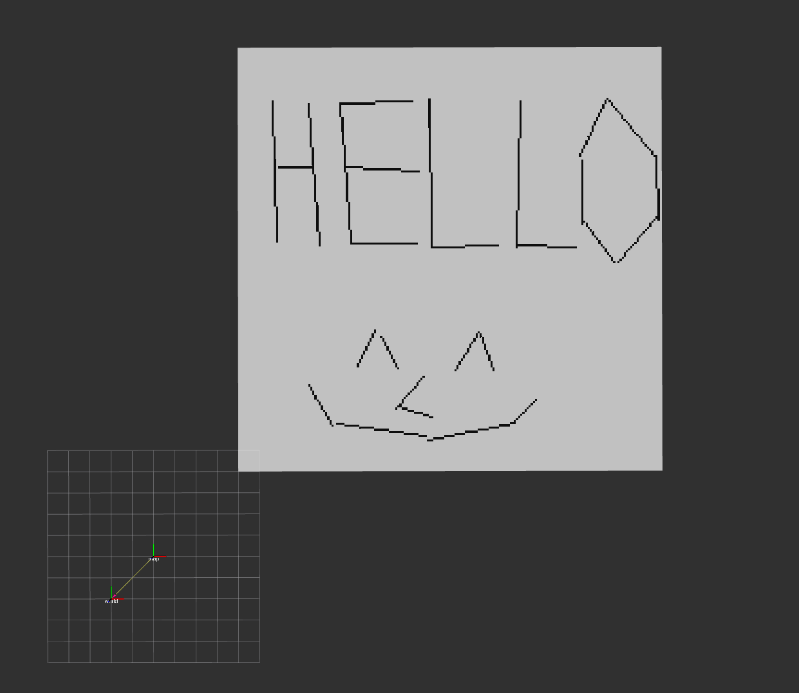
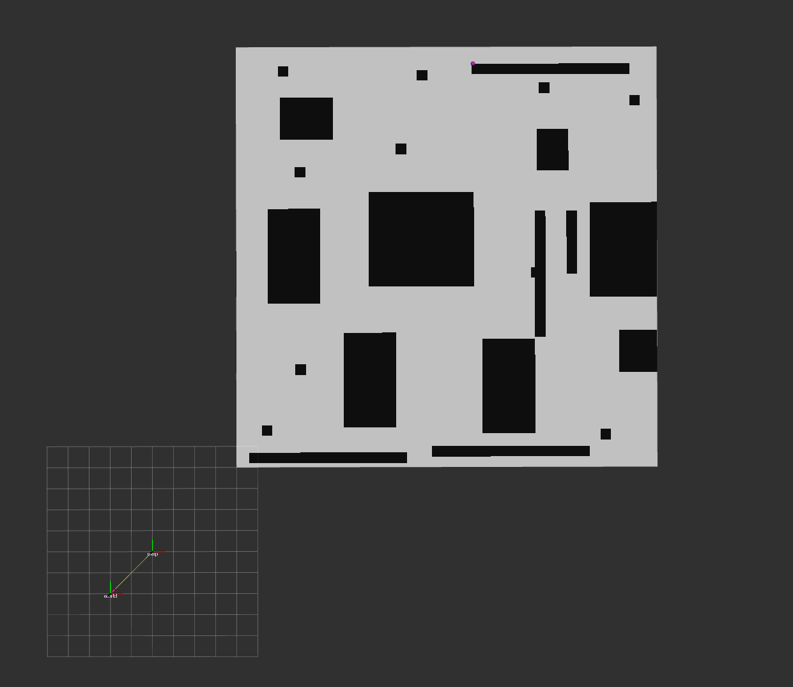
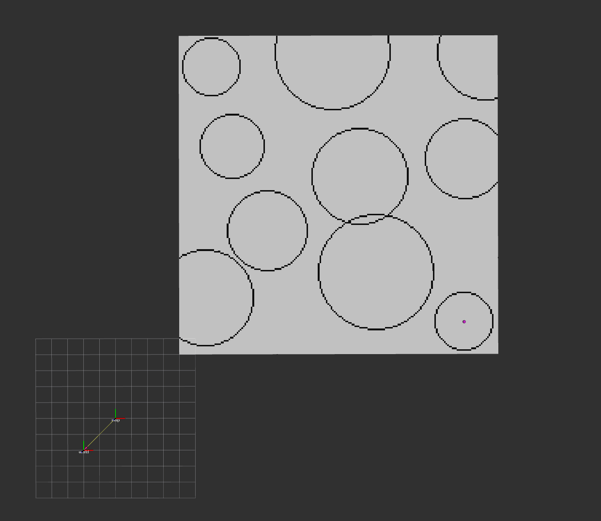
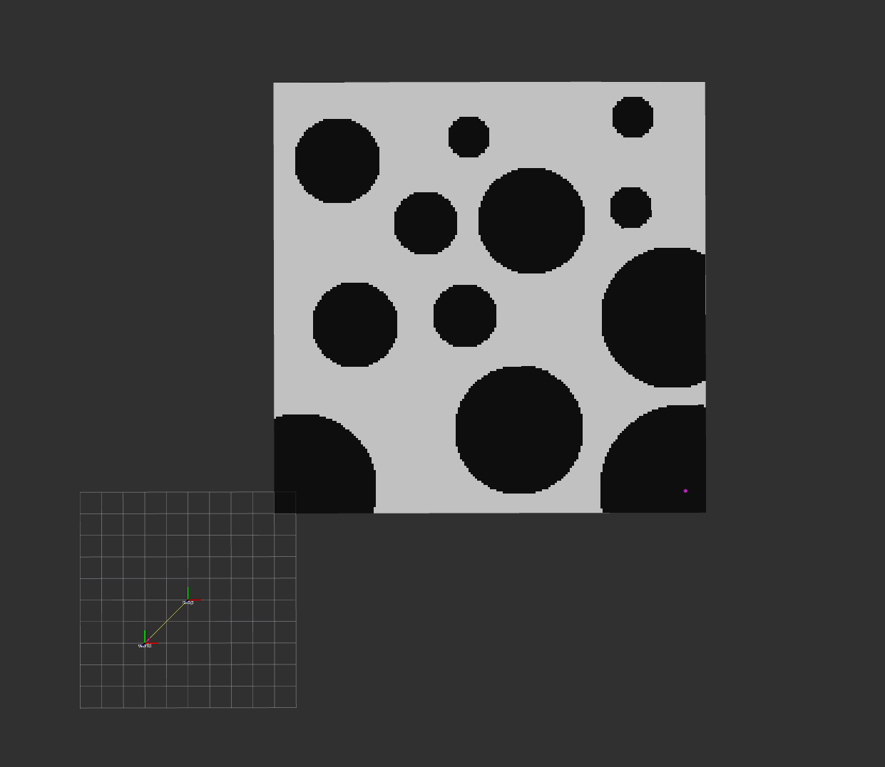
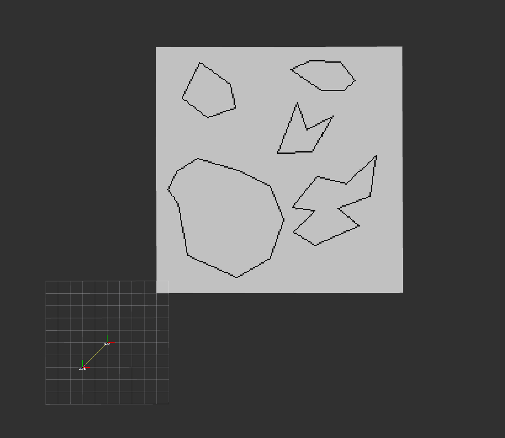
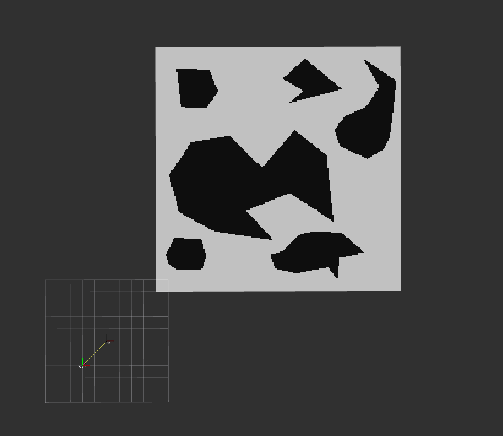
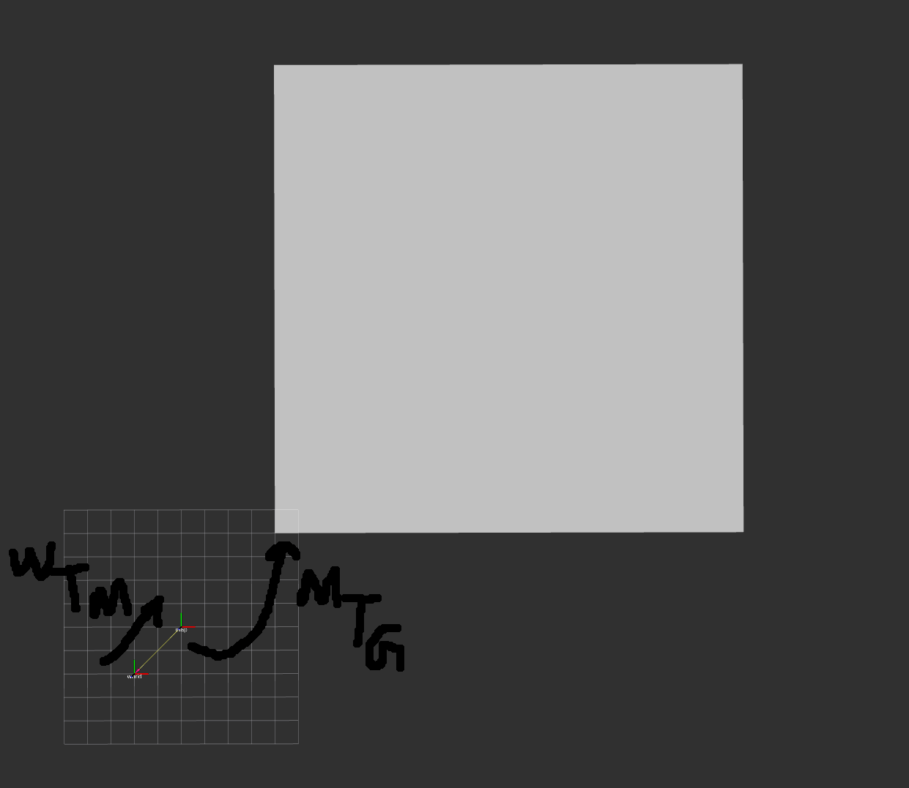

# EasyGrid

**A lightweight, header-only C++ library for managing 2D grids. Great for building occupancy, cost, or traversability maps for robotics applications in a single data structure!** 

## Motivation
2D Grids are instrumental to perception, navigation and a boatload of other tasks for mobile ground robots. As a result, I found myself rewriting grid-related functions and logic over and over again across different projects. This was ... extremely annoying. I wanted to fix this once and for all.

I wrote `EasyGrid` to create a single data structure to handle **several layers of grid information** while also keeping an **extensive set of helper methods** handy when dealing with grids. It is also header-only to make integration easy.

I must say that my library is not in any way the best, but it has been **battle-tested in production on live robots**. Libraries like the [well known grid mapping library by ANYBotics](https://github.com/ANYbotics/grid_map) are more feature rich than EasyGrid, but EasyGrid aims to **provide the most basic set of methods that can be easily extended to build more elaborate map-related stuff.**

## Nomenclature
- Cell: A discrete square cell that holds information that defines the space encompassed by that square cell.
- Grid: Made up of several Cells with a resolution, width and height.
- Map: A Grid made up of cells that holds some information. For example, a Grid containing Cells that have Occupancy information would define an OccupancyMap.

## Features
1. **Templated and extensible class:** `easy_grid::GridHandler<CellT>`  that can be used with structs containing your own set of information. This allows you to build elaborate map representations & logic with a single data structure.

2. **MetaData representation to clearly define your map:** The `easy_grid::MetaData` provides a consistent way to define your maps. It mirrors the information found in ROS *nav_msgs/msg/OccupancyGrid*.

3. **Get what you pay for:** `easy_grid::GridHandler<CellT>` constructors and assignments operators use move-semantics by default, which means you wont make expensive copies of your map unless you *really* wanted to, using `easy_grid::GridHanlder<CellT>::cloneGrid()`.

4. **Simple Data Structure:** `std::vector` is used to store Cells in a contiguous block of memory

5. **Common Spatial Conversion Methods:** Ever wanted to convert from Euclidean coordinates to Grid Coordinates but forgot how? Fret not, EasyGrid defines **Euclidean 2D Coordinate** <---> **Grid 2D Coordinate**  <---> **Index 1D for to access Cells** so you never have to think about it again.

6. **Common Checks:** Out of Bounds check, sign check, near zero check, point in polygon check, point on segment check. Pretty convenient

7. **Neighborhood Methods:** Methods to get *Cardinal (4 connected)* and *Octile (8 connected)* neighbors.

8. **Cell Accessors:** To get or set cells.

9. **Cell Iterators using Lambdas:** A set of iterators are defined such that a **lambda** can be applied to a corresponding set of cells that are traversed by a particular iterator. Each cell is guaranteed to be touched only once.
    
    a. `forEachCellDo`: Iterates through all Cells.

    b. `RayIterator`: Iterates through cells on line between 2 points using Bresenham Line Algorithm.

    c. `SubMapIterator`: Iterates through cells in a rectangular submap.

    d. `CirclePerimeterIterator`: Iterates through the perimeter cells of a circle.

    e. `CircleAreaIterator`: Iterates through the cells bounded by a circle.

    f. `PolygonPerimeterIterator`: Iterates through the cells that lie on a perimeter of a convex or concave polygon. 

    g. `PolygonAreaIterator`: Iterates through the cells that lie within a convex or concave polygon.

## Demo
### RayIterator

---
### SubMapIterator

---
### CirclePerimeterIterator

---
### CircleAreaIterator

---
### PolygonPerimeterIterator

---
### PolygonAreaIterator

---

## Installing
### Install from source
```bash
mkdir -p grid_ws/src
cd grid_ws/src
git clone https://github.com/<github user>/EasyGrid.git
cd ..
colcon build --packages-up-to easy_grid
```

## Using EasyGrid in your project
### a. The proper way
Inside your `CmakeLists.txt` for a specific package to build EasyGrid against:
```CMake

find_package(easy_grid_core REQUIRED)
add_executable(your_ros_node
  src/your_ros_node.cpp
  src/your_code.cpp
)
target_include_directories(your_ros_node
    PRIVATE
    "$<BUILD_INTERFACE:${CMAKE_CURRENT_SOURCE_DIR}/include>")

target_link_libraries(your_ros_node easy_grid_core::easy_grid)
```
**See easy_grid_ros/CmakeLists.txt for an example**

### b. The not so proper way
CTRL-A the contents of *easy_grid_core/include/easy_grid_core/easy_grid.hpp*. CTRL-C it and CTL-V it into your package's include directory. Don't worry, I won't tell anyone. 

## Usage Guide
### (a) Cell
The `easy_grid::GridHandler` must have a template argument `CellT`, which is a C++ *struct*. For example, if one wanted to have occupancy information, traversibility information, navigation cost and a timestamp for a cell, one might do this:

```cpp
struct MapCell
{
    uint8_t occupancy {0};
    double traversibility_score {0.0};
    double nav_cost {0.0};
    size_t stamp {0};
};

easy_grid::GridHandler<MapCell> my_map;
```
Be careful with the structs! Sometimes, you may end up using less memory using 2 separate maps with 2 CellT structs than lumping everything together. This has to do with **[Structure Packing](http://www.catb.org/esr/structure-packing/)**.

---
### (b) Frames
Typically in robotics applications, world and map frames are defined, with some static transformation between them. `easy_grid::GridHandler` must be relative to some frame, most commonly `map` frame. Lets say there is a static transform from World to Map, given by:
$$
^{W}T_{M}
$$

The GridHandler is attached to the `map` frame. The transformation from the map to the grid handler, given by:
$$
^{M}T_{G}
$$
is defined by the `easy_grid::MetaData` struct.
```cpp
    struct MetaData
    {
        double resolution {0.1}; //m
        size_t map_width  {100}; //num_cells
        size_t map_height {100}; //num_cells
        Eigen::Matrix4d map_frame_transform = Eigen::Matrix4d::Identity(); 
    };
```
Typically, you can set `map_frame_transform` to `Eigen::Matrix4d::Identity()` and just control the **World to Map** transform. 

**IMPORTANT: All Euclidean Coordinates passed to `easy_grid::GridHandler` must be in the *parent* frame of the `GridHandler`. The parent frame is defined by the frame the `GridHandler` is attached to. In this case, all coordinates must be in *map* frame.**


---
### (c) Construction
It is quite easy to setup the class and start using it
```cpp
struct MyCell
{
    uint8_t occupancy;
    double nav_cost;
    uint64_t timestamp; 
};

// Default constructor, everything is default constructed. Not recommended
easy_grid::GridHandler<MyCell> my_map;

/*
Constructor Using Metadata
*/
Eigen::Vector3d translation(1.0,1.0,0.0);
Eigen::Quaterniond rotation(1.0,0.0,0.0,0.0,0.0) //qw qx qy qz. ROS 2 usually expects qx qy qz qw
easy_grid::MetaData mdata1;
mdata1.set_transform(translation,rotation);
easy_grid::GridHandler<MyCell> my_map1(mdata);

/*
Constructor Using Metadata and std::vector<CellT>
*/
std::vector<MyCell> my_underlying_vec(100);
easy_grid::MetaData mdata2;
mdata2.set_transform(translation,rotation);
// Must make sure the size of the underlying vector == map_width * map_height
mdata2.map_width = 10;
mdata2.map_height = 10;
easy_grid::GridHandler<MyCell> my_map2(mdata2,my_underlying_vec)

/*
Constructor using std::move
*/
easy_grid::GridHandler<MyCell> my_map3(std::move(my_map2));

/*
Move Assignment
*/
my_map = std::move(my_map1);
```
**Warning: Watch out when using move semantics, the "moved" things becomes unusable**

---
### (c) Conversions, Bounds Check, Neighborhood, Cell Access and Cell Setting
We show a simple method to check if a cell's occupancy is 100, then the octile neighbor cells to 100 as well.

```cpp
// The parent coordinate
Eigen::Vector3d parent_coord(10.0,13.0,18.0)
// Convert from parent euclidean coordinate to grid coordinate
Eigen::Vector2i grid_coord = my_map.parentToGrid(parent_coord);
// Convert from grid coordinate to index of the underlying vec 
size_t index = my_map.gridToIndex(grid_coord)

// New cell to set
MyCell new_cell;
new_cell.occupancy = 100;

// Do a bounds check and get the cell using an index
if (!my_map.outOfBound(index) && my_map.getCell(index).occupancy == 100)
{
    // Octile Neighborhood method containing 8 neighbor grids
    std::array<Eigen::Vector2i,8> octile_nb = my_map.getOctileNeighbors(grid_coord);
    //Loop through the octile neibors
    for (auto &nb_grid_coord : octile_nb)
    {
        // Do a bounds check because neighbors might not be within the map. Bounds check can be done using Eigen::Vector2i as well
        if (my_map.outOfBound(nb_grid_coord))
        {
            // skip if oob
            continue;
        }
        // Get a reference to the cell using getCell and check its value
        if (my_map.getCell(nb_grid_coord).occupancy < 100)
        {
            // Set the cell value
            my_map.setCell(nb_grid_coord,new_cell);
        }
    }
}
```
### (d) Iterators
Iterators take lambdas with signature Eigen::Vector2i as its param.
Recommended to use Eigen::Vector2i& to avoid copies.

### forEachCellDo
```cpp
const auto setter_func = [&](Eigen::Vector2i &grid_coord)
                        {
                            MyCell to_set;
                            to_set.occupancy = 100;
                            my_map.setCell(grid_coord,to_set)
                        }
//Iterate through all the cells and set occupancy to 100
my_map.forEachCellDo(setter_func);
//Can also do this
my_map.ForEachCellDo([&](Eigen::Vector2i &grid_coord)
                        {
                            MyCell to_set;
                            to_set.occupancy = 100;
                            my_map.setCell(grid_coord,to_set)
                        });
```
### RayIterator

```cpp
const auto setter_func = [&](Eigen::Vector2i &grid_coord)
                        {
                            MyCell to_set;
                            to_set.occupancy = 100;
                            my_map.setCell(grid_coord,to_set)
                        }
Eigen::Vector2d start(1.0,1.0);
Eigen::Vector2d goal(10.0,10.0);
my_map.RayIterator(start,goal,setter_func);
```

### SubMapIterator

```cpp
const auto setter_func = [&](Eigen::Vector2i &grid_coord)
                        {
                            MyCell to_set;
                            to_set.occupancy = 100;
                            my_map.setCell(grid_coord,to_set)
                        }
Eigen::Vector2d topleft(100.0,100.0);
submap_width = 100 //in number of cells
submap_height = 50 //in number of cells
my_map.RayIterator(top_left,submap_width,submp_height,setter_func);
```

### CirclePerimeterIterator & CircleAreaIterator

```cpp
const auto setter_func = [&](Eigen::Vector2i &grid_coord)
                        {
                            MyCell to_set;
                            to_set.occupancy = 100;
                            my_map.setCell(grid_coord,to_set)
                        }
Eigen::Vector2d center1(100.0,100.0);
Eigen::Vector2d center2(50.0,50.0);
double radius = 10.0 #m

my_map.CirclePerimeterIterator(center1,radius,setter_func);
my_map.CircleAreaIterator(center2,radius,setter_func);
```

### PolygonPerimeterIterator & PolygonAreaIterator

```cpp
const auto setter_func = [&](Eigen::Vector2i &grid_coord)
                        {
                            MyCell to_set;
                            to_set.occupancy = 100;
                            my_map.setCell(grid_coord,to_set)
                        }
//Lets assume these vectors contain vertices of a polygon in clockwise/anticlockwise order. Note that it is an open polygon, which means first point != last point
std::vector<Eigen::Vector2d> polygon1;
std::vector<Eigen::Vector2d> polygon2;

my_map.PolygonPerimeterIterator(polygon1,setter_func);
my_map.PolygonAreaIterator(polygon2,setter_func);
```
